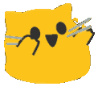

<h1 align="center">  Hey! Nice to see you </h1>

 
    

 

- 👋 My name is Ricky Lu
- 👀 I’m interested in software engineering (everyone is right? hehe)
- 😆 Good news I'm AWS certified

<h1 align="center">  Here is what I know!</h1>

<h1 align="center">  My stats!!</h1>

<marquee style="font-size:50px; font-family: cursive; color: #466D1D;" scrollamount="30" >Thank you for visiting!</marquee>
